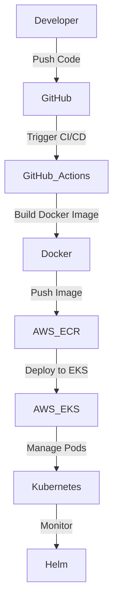

# DevOps Project: Hello World CI/CD Pipeline

## Overview
This project demonstrates my hands-on learning experience with setting up a CI/CD pipeline using modern DevOps tools. The goal was to containerize a simple "Hello World" file, deploy it using Kubernetes (EKS), and integrate continuous deployment using GitHub Actions.

---

## Technologies Used

---

## Key Learning Points
1. **CI/CD Pipeline**: Implemented an automated pipeline using **GitHub Actions** to build, test, and deploy the project.
2. **Containerization**: Packaged the application using **Docker**, ensuring consistency across environments.
3. **Kubernetes (EKS)**: Deployed the application to **AWS EKS** (Elastic Kubernetes Service) to manage and scale the container.
4. **Helm**: Used **Helm** to manage Kubernetes deployments, making it easier to define, install, and upgrade the Kubernetes applications.

---

## Pain Points & Troubleshooting

1. **Helm Path Issue**: Encountered an error where Helm couldn't find the chart path. This was resolved by ensuring the correct directory structure and files were pushed to GitHub.
2. **AWS Permissions**: Faced challenges with AWS permissions, which required correctly configuring **IAM roles** and policies for EKS and EC2.
3. **Cluster Setup**: Learned how to create an EKS cluster using `eksctl`, troubleshooting issues related to permissions and resource limits.

---

## DevOps Concepts Applied

- **Continuous Integration**: Automated the process of building and testing the "Hello World" file with GitHub Actions.
- **Continuous Deployment**: Implemented automated deployment to AWS EKS, ensuring smooth transitions from code push to production.
- **Containerization**: Built Docker images to ensure that the app runs consistently in any environment.
- **Kubernetes Orchestration**: Used EKS to orchestrate the deployment and management of containers.
- **Infrastructure as Code**: Used `eksctl` and Helm to automate the creation and management of infrastructure.

---

## Workflow Diagram

---

### Screenshots and Metrics (Optional)
If you’d like to show screenshots of your CI/CD workflow, Kubernetes dashboard, or Prometheus/Grafana metrics, add those here.

